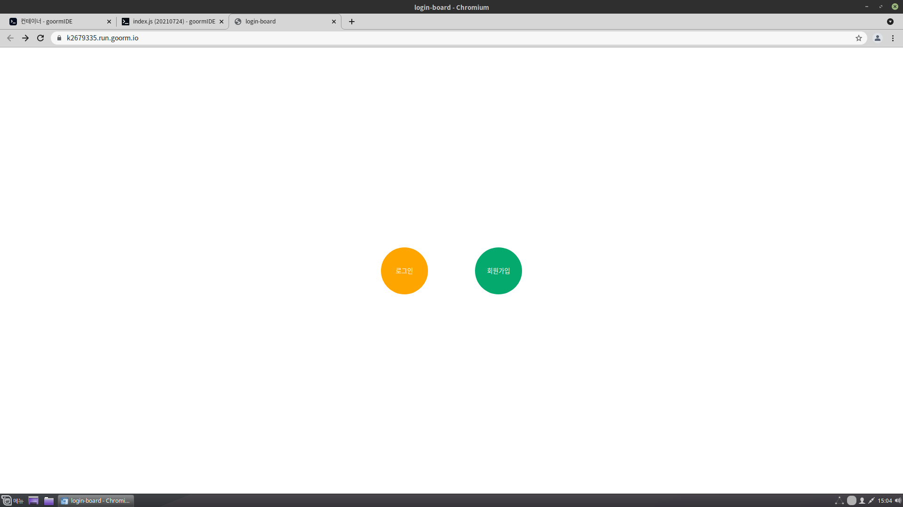
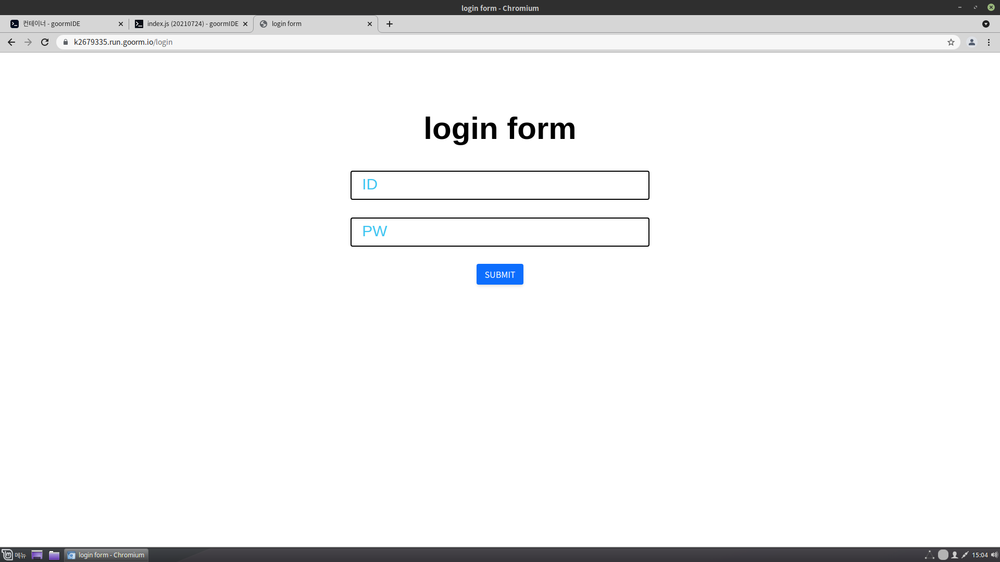
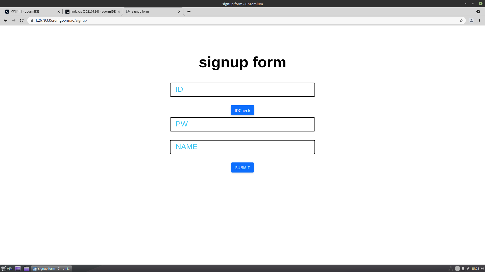
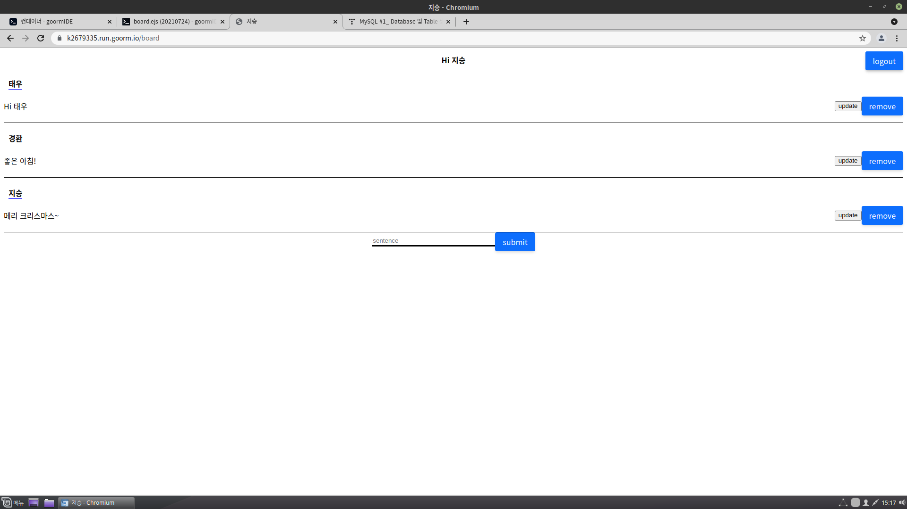

<div id="top"></div>
<!--
*** Thanks for checking out the Best-README-Template. If you have a suggestion
*** that would make this better, please fork the repo and create a pull request
*** or simply open an issue with the tag "enhancement".
*** Don't forget to give the project a star!
*** Thanks again! Now go create something AMAZING! :D
-->


<!-- PROJECT SHIELDS -->
<!--
*** I'm using markdown "reference style" links for readability.
*** Reference links are enclosed in brackets [ ] instead of parentheses ( ).
*** See the bottom of this document for the declaration of the reference variables
*** for contributors-url, forks-url, etc. This is an optional, concise syntax you may use.
*** https://www.markdownguide.org/basic-syntax/#reference-style-links
-->


<!-- PROJECT LOGO -->
<br />
<div align="center">
  

<h3 align="center">login-board</h3>

  <p align="center">
    로그인, 회원가입 기능이 있는 게시판 \ 
    <br />
    <a href="https://github.com/ji-seung-ryu/login-board"><strong>Explore the docs »</strong></a>
    <br />
    <br />
    <a href="https://github.com/ji-seung-ryu/login-board">View Demo</a>
    ·
    <a href="https://github.com/ji-seung-ryu/login-board/issues">Report Bug</a>
    ·
    <a href="https://github.com/ji-seung-ryu/login-board/issues">Request Feature</a>
  </p>
</div>


<!-- TABLE OF CONTENTS -->
<details>
  <summary>Table of Contents</summary>
  <ol>
    <li>
      <a href="#about-the-project">About The Project</a>
      <ul>
        <li><a href="#built-with">Built With</a></li>
      </ul>
    </li>
    <li>
      <a href="#getting-started">Getting Started</a>
      <ul>
        <li><a href="#prerequisites">Prerequisites</a></li>
        <li><a href="#installation">Installation</a></li>
      </ul>
    </li>
    <li><a href="#usage">Usage</a></li>
    <li><a href="#license">License</a></li>
    <li><a href="#contact">Contact</a></li>
  </ol>
</details>


<!-- ABOUT THE PROJECT -->
## About The Project


you can go either login page or signup page

you can login + after login, you can go board page 

you can signup + IDcheck button checks if id is duplicated

you can write, update, delete your comments NOT others 
 


<p align="right">(<a href="#top">back to top</a>)</p>


### Built With

* [express](https://expressjs.com/)
* [JQuery](https://jquery.com)

<p align="right">(<a href="#top">back to top</a>)</p>


<!-- GETTING STARTED -->
## Getting Started


### Prerequisites

* npm
  ```sh
  npm install npm@latest -g
  ```

* mysql
  ```sh
  npm install mysql
  ```

* express
  ```sh
  npm install express
  ```
  
### Installation

1. Clone the repo
   ```sh
   git clone https://github.com/ji-seung-ryu/login-board.git
   ```
2. Install NPM packages
   ```sh
   npm install
   ```
3. make config folder and make pool.js in the folder. pool.js should be following code.
   ```js
   const mysql = require('mysql2/promise');

   const pool = mysql.createPool({
   host: 'localhost',
   user: your name,
   password: your password,
   port: your port number,
   database: your database name,
   });


   module.exports = pool;  
   ```	
4. move to login-board
   ```sh
   cd login-board
   ```
5. start mysql service
   ```sh
   service mysql start
   ```
6. Run app.js in local 
   ```sh
   node app.js
   ```

<p align="right">(<a href="#top">back to top</a>)</p>


<!-- USAGE EXAMPLES -->
## Usage

Use login-board whenever you need!

<p align="right">(<a href="#top">back to top</a>)</p>


<!-- LICENSE -->
## License

Distributed under the MIT License. See `LICENSE.txt` for more information.

<p align="right">(<a href="#top">back to top</a>)</p>


<!-- CONTACT -->
## Contact

8514199@gmail.com

[https://www.instagram.com/ji_seungg/?hl=ko](https://www.instagram.com/ji_seungg/?hl=ko)

[https://github.com/ji-seung-ryu/login-board](https://github.com/ji-seung-ryu/login-board)

<p align="right">(<a href="#top">back to top</a>)</p>


